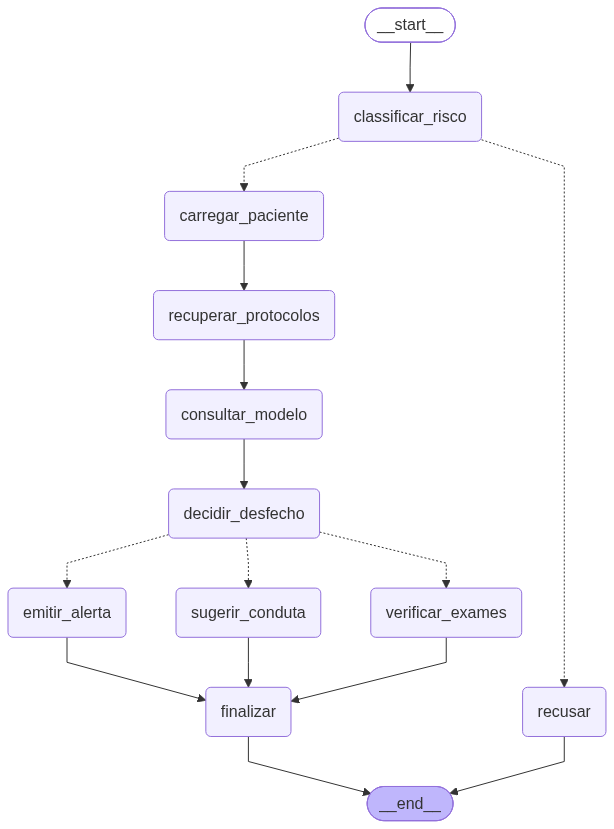

# Tech Challenge — Fase 3

Assistente virtual médico de apoio à decisão clínica: LLM com fine-tuning,
recuperação de protocolos internos via LangChain e fluxo de decisão
automatizado com LangGraph.

> ⚠️ **Aviso importante**
> Todos os dados deste repositório são **sintéticos** e foram gerados para fins
> acadêmicos. Protocolos, códigos internos (`PROT-0XX`, `LAUDO-XXX-XX`), doses,
> prazos e pacientes são **fictícios**, não foram validados por profissionais de
> saúde e **não devem ser utilizados para decisões clínicas reais**.

---

## Índice

- [O que o sistema faz](#o-que-o-sistema-faz)
- [Arquitetura](#arquitetura)
- [Estrutura do repositório](#estrutura-do-repositório)
- [Como executar](#como-executar)
- [O modelo treinado](#o-modelo-treinado)
- [As bases de dados](#as-bases-de-dados)
- [Segurança e validação](#segurança-e-validação)
- [Resultados](#resultados)
- [Decisões de projeto](#decisões-de-projeto)
- [Limitações](#limitações)
- [Requisitos do desafio](#requisitos-do-desafio)

---

## O que o sistema faz

Recebe uma pergunta clínica, opcionalmente vinculada a um paciente da base de
prontuários, e devolve uma resposta que:

- recupera os protocolos internos pertinentes ao caso
- contextualiza com os dados do paciente (sinais vitais, exames, antecedentes)
- roteia para um de três desfechos, conforme o estado clínico
- cita as fontes efetivamente consultadas
- exige validação humana antes de qualquer conduta
- registra tudo em log auditável

### Os três desfechos

| Desfecho | Quando ocorre | O que o assistente faz |
|---|---|---|
| `VERIFICAR_EXAMES` | Há exames sem resultado | Lista os pendentes e recusa conduta definitiva |
| `EMITIR_ALERTA` | Há sinal de gravidade | Sinaliza urgência e lista os achados de alarme |
| `SUGERIR_CONDUTA` | Dados suficientes, sem gravidade | Descreve o que o protocolo prevê, com ressalva |

---

## Arquitetura

```
START
  ↓
carregar_paciente        consulta a base estruturada de prontuários
  ↓
recuperar_protocolos     RAG sobre os protocolos internos (LangChain + Chroma)
  ↓
consultar_modelo         LLM fine-tuned gera o texto da resposta
  ↓
decidir_desfecho         regra determinística sobre o prontuário
  ↓
[roteamento condicional]
  ├──> verificar_exames
  ├──> sugerir_conduta
  └──> emitir_alerta
          ↓
       finalizar         guardrail + citação de fontes
          ↓
        END
```



O diagrama é gerado a partir do grafo compilado
(`grafo.get_graph().draw_mermaid_png()`), não desenhado à parte — logo não
divergem.

### As três camadas de conhecimento

| Camada | O que garante | Onde vive |
|---|---|---|
| Modelo fine-tuned | Formato e comportamento: citar fonte, exigir validação | Adapters LoRA |
| RAG (LangChain) | Conteúdo factual dos protocolos | Vector store Chroma |
| Grafo (LangGraph) | Decisão de fluxo auditável | Regra determinística em código |

A separação é intencional. Com LoRA sobre um volume moderado de exemplos, o
modelo aprende **comportamento**, não conhecimento clínico — o conteúdo factual
vem do RAG. E a decisão de fluxo não é delegada ao modelo: veja
[Decisões de projeto](#decisões-de-projeto).

---

## Estrutura do repositório

```
TECH-CHALLENGE-3/
├── src/
│   ├── config.py                caminhos, modelo, parâmetros de RAG e decisão
│   ├── rag/
│   │   ├── documentos.py        carrega .md com frontmatter, faz chunking
│   │   ├── prontuarios.py       consulta estruturada + detecção de gravidade
│   │   └── vectorstore.py       indexação Chroma, retriever com escopo
│   ├── llm/
│   │   └── modelo.py            carrega Qwen+LoRA, gera, pós-processa
│   ├── graph/
│   │   ├── estado.py            EstadoClinico (TypedDict)
│   │   ├── nos.py               nós do grafo + regra de decisão
│   │   └── fluxo.py             montagem do grafo + AssistenteClinico
│   └── auditoria/
│       └── registro.py          logging estruturado em JSONL
├── data/
│   ├── protocolos/              14 protocolos internos (base do RAG)
│   ├── prontuarios.json         8 pacientes fictícios
│   ├── dataset_medico.jsonl     95 exemplos de fine-tuning
│   └── README.md                documentação das bases
├── notebooks/
│   ├── 01_gerar_dataset.ipynb   geração e curadoria do dataset
│   ├── 02_finetuning.ipynb      fine-tuning QLoRA
│   └── 03_demo_assistente.ipynb demonstração de ponta a ponta
├── scripts/
│   └── demo.py                  execução do assistente por linha de comando
├── docs/
│   ├── analise_e_limitacoes.md  avaliação crítica da execução
│   └── resultados/
│       ├── curva_loss.png       perda do treino
│       ├── avaliacao_modelo.json métricas do fine-tuning
│       ├── validacao_rag.md     medição da recuperação
│       ├── demo.jsonl           log da execução completa
│       └── diagrama_grafo.png   fluxo do LangGraph
├── logs/                        registros de auditoria (não versionados)
├── verificar_ambiente.py        valida o ambiente sem baixar modelo
└── pyproject.toml
```

---

## Como executar

### Opção A — Colab com GPU (recomendado)

Abra `notebooks/03_demo_assistente.ipynb` no Google Colab, selecione **GPU T4**
em Ambiente de execução → Alterar tipo de ambiente, e execute as células em
ordem.

O notebook clona este repositório, instala as dependências, indexa os
protocolos, carrega o modelo em 4-bit e roda os 8 pacientes. Cada consulta leva
cerca de 30 segundos.

Nenhum token é necessário: o modelo base e os adapters são públicos.

### Opção B — Local

```bash
git clone https://github.com/mvaraujo1977/TECH-CHALLENGE-3.git
cd TECH-CHALLENGE-3

uv venv
uv pip install -e .

# valida o ambiente antes de baixar qualquer modelo
python verificar_ambiente.py

# executa o assistente
python scripts/demo.py
```

Com GPU NVIDIA, instale também o extra de quantização:

```bash
uv pip install -e ".[gpu]"
```

**Sem GPU**, o assistente roda mas fica lento — cerca de 500 segundos por
consulta com o modelo de 3B em CPU, contra 30 na T4. Para reduzir o consumo de
memória de ~12 GB para ~6 GB, passe `dtype_cpu="bfloat16"`:

```python
from src.graph.fluxo import criar_assistente

assistente = criar_assistente(dtype_cpu="bfloat16", max_new_tokens=200)
resposta, registro = assistente.consultar(
    "Qual a conduta indicada?", id_paciente="PAC-001"
)
print(resposta)
print(registro.resumo())
```

### Uso programático

```python
from src.graph.fluxo import criar_assistente

assistente = criar_assistente()

# consulta vinculada a um paciente
resposta, registro = assistente.consultar(
    "Qual a conduta indicada para este paciente?",
    id_paciente="PAC-008",
)

print(resposta)
print(f"Desfecho: {registro.desfecho} ({registro.motivo_desfecho})")
print(f"Fontes: {[f['codigo'] for f in registro.fontes]}")
print(f"Caminho: {' → '.join(registro.caminho_no_grafo)}")

# consulta geral, sem paciente
resposta, _ = assistente.consultar(
    "Quais exames são obrigatórios no pré-operatório eletivo?"
)
```

### Componentes isolados

Cada camada funciona sozinha, o que permite testar sem carregar o LLM:

```python
# recuperação, sem modelo de linguagem
from src.rag.vectorstore import criar_retriever, indexar
from src.rag import prontuarios as pr

retriever = criar_retriever(indexar())
paciente = pr.buscar_paciente("PAC-007")

docs = retriever.invoke(
    paciente["admissao"]["queixa"],
    codigos=paciente["protocolos_relacionados"],
)

# regra de decisão, sem grafo
from src.graph.nos import decidir_desfecho

decidir_desfecho({
    "paciente": paciente,
    "sinais_gravidade": pr.sinais_de_gravidade(paciente),
    "exames_pendentes": pr.exames_pendentes(paciente),
})
```

---

## O modelo treinado

| | |
|---|---|
| **Base** | [`Qwen/Qwen2.5-3B-Instruct`](https://huggingface.co/Qwen/Qwen2.5-3B-Instruct) |
| **Adapters LoRA** | [`mvaraujo1977/assistente-medico-lora`](https://huggingface.co/mvaraujo1977/assistente-medico-lora) (público) |
| **Técnica** | QLoRA — quantização 4-bit NF4 + LoRA |
| **LoRA** | `r=16`, `alpha=32`, `dropout=0.05` |
| **Módulos** | `q_proj`, `k_proj`, `v_proj`, `o_proj`, `gate_proj`, `up_proj`, `down_proj` |
| **Treino** | 4 épocas, lr 2e-4 cosine, batch efetivo 8 |
| **Dados** | 81 treino / 14 avaliação, estratificado por categoria |

Detalhes do processo, curva de perda e avaliação em
`notebooks/02_finetuning.ipynb` e `docs/resultados/`.

### Por que Qwen2.5-3B e não LLaMA

O enunciado sugere LLaMA ou Falcon, mas admite outros modelos. A escolha foi
motivada por:

- **Sem gate de licença.** O `meta-llama/Llama-3.2-3B-Instruct` exige aprovação
  individual da Meta — a tentativa retornou `403 GatedRepoError`. Isso quebraria
  a reprodutibilidade para o grupo e para a banca.
- **Mesma faixa de parâmetros** (3B), cabendo em T4/L4 com quantização 4-bit.
- **Template de chat bem definido**, aplicado via `apply_chat_template()`.

Trocar exige alterar uma linha (`MODELO_BASE` em `src/config.py`).

---

## As bases de dados

Três bases com papéis distintos — a confusão entre elas é comum, então vale
separar:

| Base | Papel | Consumida por |
|---|---|---|
| `dataset_medico.jsonl` | Treino do modelo (comportamento e formato) | Fine-tuning, concluído |
| `protocolos/` | Conhecimento factual recuperável | RAG, em tempo de execução |
| `prontuarios.json` | Dados do paciente | Nós do grafo, em tempo de execução |

Documentação detalhada em [`data/README.md`](data/README.md).

### Protocolos

14 documentos markdown com frontmatter YAML (`codigo`, `titulo`, `versao`,
`setor`, `revisao`). O frontmatter alimenta os metadados dos chunks no vector
store, permitindo citar a fonte exata na resposta.

Cobrem sepse, síndrome coronariana aguda, AVC, pré-operatório,
tromboembolismo, cetoacidose, tromboprofilaxia, controle glicêmico, crise
hipertensiva, prescrição de controlados, isolamento e anafilaxia, mais dois
modelos de laudo.

### Prontuários

8 pacientes com identificação, admissão, antecedentes, alergias, medicamentos,
sinais vitais e exames com status. Construídos para exercitar os três
desfechos do grafo.

O campo `protocolos_relacionados` de cada paciente é usado para restringir a
recuperação — veja [Decisões de projeto](#decisões-de-projeto).

---

## Segurança e validação

O requisito 3 do desafio pede três coisas. Como cada uma foi atendida:

### Limites de atuação

O assistente nunca prescreve diretamente. A ressalva de validação humana é
garantida em **duas camadas**:

1. **Fine-tuning** — o modelo foi treinado para fechar respostas de conduta com
   a ressalva. Na execução medida, fez isso espontaneamente em 7 de 8 casos.
2. **Código** — `garantir_guardrail()` insere a ressalva se ela estiver ausente.
   O registro de auditoria marca quando a inserção foi necessária, o que mede
   quantas vezes o modelo falhou sozinho.

A verificação é feita **sobre o texto do modelo, isolado do bloco de ações**.
Verificar o texto montado produzia falso positivo: a ação "Acionar o médico
responsável" contém as mesmas palavras da ressalva, e a resposta saía sem o
aviso.

### Logging para auditoria

Cada consulta grava um registro em JSONL, append-only, com:

```json
{
  "id": "2b111fb0",
  "momento": "2026-09-10T18:21:03+00:00",
  "pergunta": "Qual a conduta indicada para este paciente?",
  "id_paciente": "PAC-001",
  "fontes": [{"codigo": "PROT-007", "titulo": "...", "versao": "4", "chunks": [1, 2]}],
  "trechos_recuperados": 4,
  "desfecho": "VERIFICAR_EXAMES",
  "motivo_desfecho": "2 exame(s) sem resultado disponível",
  "sinais_gravidade": [],
  "exames_pendentes": ["D-dímero", "Angiotomografia de tórax"],
  "desfecho_do_modelo": null,
  "concorda_com_modelo": null,
  "guardrail_adicionado": false,
  "caminho_no_grafo": ["carregar_paciente", "recuperar_protocolos", "..."],
  "duracao_s": 34.2,
  "modelo": "Qwen/Qwen2.5-3B-Instruct em cuda | adapter ... | 4-bit"
}
```

`Auditoria.estatisticas()` agrega as métricas para relatório.

### Explainability

A citação de fonte vem dos **documentos efetivamente recuperados pelo
retriever**, não do código que o modelo escreveu no texto.

Isso importa porque os códigos que o modelo produz não são confiáveis: durante
a geração do dataset, o mesmo código foi associado a temas diferentes em lotes
distintos (`PROT-012` aparece como TEP, checklist de alta e controle glicêmico).
O fine-tuning ensinou o *formato* de citar uma fonte, não um mapeamento
código→conteúdo.

Cada fonte citada traz código, título, versão e os índices de chunk usados —
rastreável até o arquivo e a seção.

---

## Resultados

Execução dos 8 pacientes em GPU T4, modelo em 4-bit.

| Métrica | Resultado |
|---|---|
| Citação de fonte na resposta | 8/8 |
| Fonte recuperada pertinente ao caso | 8/8 |
| Ressalva de validação na resposta final | 8/8 |
| — espontânea do modelo | 7/8 |
| — inserida por código | 1/8 |
| Rótulo de decisão válido emitido pelo modelo | 2/8 |
| — clinicamente correto | 0/8 |
| Registros de auditoria completos | 8/8 |

Tempo médio: ~30 s por consulta em T4.

### Recuperação

Medição da camada de RAG isolada, sem o LLM. Detalhes em
`docs/resultados/validacao_rag.md`.

| | Filtro por similaridade | Escopo curado |
|---|---|---|
| Acertos | 3/11 | 11/11 |
| Protocolo de outra condição | 5 | 0 |
| Faltantes | 8 | 0 |

**A análise crítica completa, incluindo os erros clínicos encontrados nas
respostas geradas, está em
[`docs/analise_e_limitacoes.md`](docs/analise_e_limitacoes.md).** É leitura
necessária para interpretar os números acima — o formato está correto em 8/8,
mas o conteúdo clínico apresenta erros em 3/8.

---

## Decisões de projeto

Duas escolhas de arquitetura foram tomadas a partir de medição, não de
preferência. Ambas movem responsabilidade do LLM para código determinístico.

### 1. O roteamento não é delegado ao modelo

**Medição.** O modelo falhou em emitir um rótulo de decisão utilizável em 8 de
8 casos: rótulos inventados (`VERIFICAR`, `VERIFICAR CONTA`, `AVALIAR`),
ausência de rótulo, ou rótulo válido com classificação clinicamente errada. Em
CPU com bfloat16, produziu `SUGERIR CONDUÇÃO` — corrupção diferente, mesma taxa
de acerto.

**Decisão.** `decidir_desfecho()` aplica uma regra explícita sobre o prontuário:

```
sinais de gravidade  → EMITIR_ALERTA
exames pendentes     → VERIFICAR_EXAMES
nenhum dos dois      → SUGERIR_CONDUTA
```

Gravidade tem precedência: um paciente instável com exames pendentes precisa de
alerta imediato, e o nó de alerta lista os pendentes de todo modo.

**Efeito.** Em 2 dos 8 casos o modelo classificou urgência como rotina — AVC em
janela terapêutica e cetoacidose grave. A regra corrigiu ambos.

O rótulo do modelo continua sendo registrado (`desfecho_do_modelo`) e comparado
com a decisão (`concorda_com_modelo`), o que mantém a métrica de concordância
sem dar ao modelo poder de decisão.

### 2. A recuperação usa o escopo curado do prontuário

**Medição.** Filtrar por score de similaridade não separava protocolo pertinente
de irrelevante. Distribuição em cosseno com `bge-m3`:

| | mediana |
|---|---|
| Chunks em `protocolos_relacionados` | 0.558 |
| Chunks fora | 0.550 |

Diferença de 0.008. Não existe limiar que separe as classes — o corte atuava
como filtro de volume, não de pertinência.

**Decisão.** Quando o prontuário indica quais protocolos se aplicam, a busca é
restrita a eles, **sem aplicar corte de relevância**. O corte só vale para busca
livre, sem paciente vinculado.

**Efeito.** A recuperação passou de 3/11 para 11/11 acertos. Dois chunks
devolvidos ficam abaixo do corte (0.4202 e 0.4200 no PAC-008) — se o corte
valesse dentro do escopo, a sepse ficaria sem protocolo.

### 3. Detecção de gravidade em três fontes

A heurística inicial lia apenas sinais vitais, e deixou passar um IAMCSST
confirmado (supra de ST em três derivações, troponina 3,8 ng/mL) porque
pressão, saturação e frequência estavam normais — a gravidade estava no ECG.

A detecção passou a ler:

- **sinais vitais**, com limiares conservadores
- **resultados de exames** — achados críticos em texto livre e limiares
  numéricos (troponina, lactato)
- **protocolos de urgência** associados ao paciente no prontuário

A busca em texto livre verifica negação: o laudo "Sem hemorragia ou isquemia
aguda" gerava alerta hemorrágico por casamento de substring, invertendo o
significado do documento. Corrigido e validado em 8 casos de negação.

---

## Limitações

Resumo. A análise completa está em
[`docs/analise_e_limitacoes.md`](docs/analise_e_limitacoes.md).

- **O modelo erra conteúdo clínico.** Em 3 de 8 respostas: inversão do que o
  protocolo recuperado diz, posologia inventada, classificação de gravidade
  equivocada. O erro vem com citação formalmente correta, o que o torna mais
  difícil de detectar.
- **Exatidão regulatória não validada.** Protocolos, códigos, listas de
  controle e posologias são fictícios e não foram revisados por profissional de
  saúde.
- **Escala de demonstração.** 8 pacientes, 14 protocolos, 95 exemplos de treino.
  Indica tendência, não significância estatística.
- **Curadoria assumida correta.** O escopo de recuperação depende do campo
  `protocolos_relacionados`, atribuído manualmente. Um erro nele propagaria sem
  sinal de alerta.
- **Avaliação por padrão textual.** As métricas verificam presença de padrão por
  palavra-chave — se a ressalva está no texto, não se é adequada ao conteúdo.
- **Correção clínica não medida sistematicamente.** Os erros de conteúdo foram
  encontrados por leitura, não por método. Métrica automática exigiria anotação
  por profissional de saúde.
- **Anonimização por regex tem casos de borda.** No dataset de treino, um nome
  com quatro iniciais escapou de um padrão escrito para três — detectado por
  verificação automática. Em produção, ferramentas dedicadas (ex.: Presidio)
  seriam o caminho.

---

## Requisitos do desafio

| Requisito | Status | Onde |
|---|---|---|
| **1. Fine-tuning com dados médicos internos** | ✅ | `notebooks/02_finetuning.ipynb` |
| — preprocessing, anonimização, curadoria | ✅ | `notebooks/01_gerar_dataset.ipynb` |
| **2. Assistente médico com LangChain** | ✅ | `src/rag/`, `src/graph/` |
| — pipeline integrando a LLM customizada | ✅ | `src/llm/modelo.py` |
| — consulta a base estruturada | ✅ | `src/rag/prontuarios.py` |
| — contextualização com dados do paciente | ✅ | `src/graph/nos.py` |
| **3. Segurança e validação** | ✅ | |
| — limites de atuação | ✅ | `garantir_guardrail()` em `src/llm/modelo.py` |
| — logging detalhado | ✅ | `src/auditoria/registro.py` |
| — explainability | ✅ | `citar_fontes()` + metadados dos chunks |
| **4. Organização do código** | ✅ | `src/` modularizado, este README |

### Entregáveis

| Item | Onde |
|---|---|
| Pipeline de fine-tuning | `notebooks/02_finetuning.ipynb` |
| Integração com LangChain | `src/rag/`, `src/llm/` |
| Fluxos do LangGraph | `src/graph/` |
| Dataset anonimizado | `data/dataset_medico.jsonl` |
| Diagrama do fluxo | `docs/resultados/diagrama_grafo.png` |
| Avaliação e análise | `docs/analise_e_limitacoes.md`, `docs/resultados/` |

---

## Equipe

<!-- Preencher com os integrantes do grupo -->

| Nome | RM |
|---|---|
| | |
